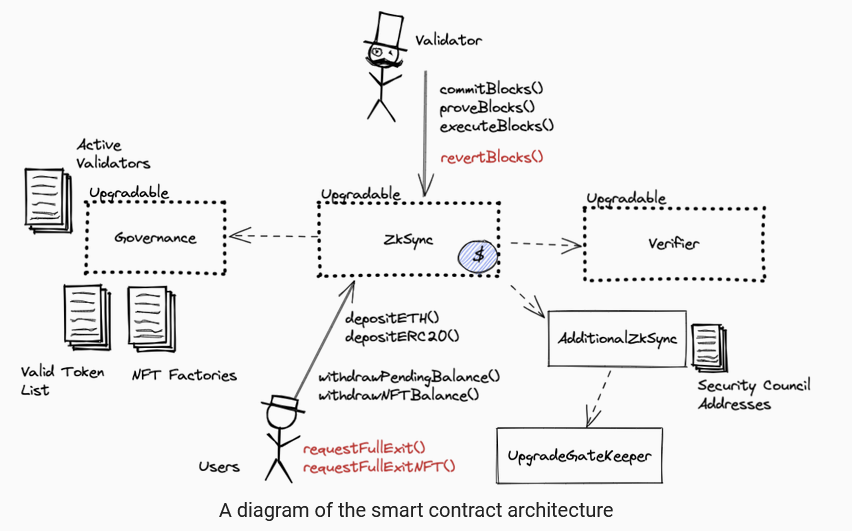

# Setup

> zkSync contract structure is really complicated for beginner like me. It took me more than 1 months to fully setup and start writing scripts to test it.

<aside>
💡 This document will serve as guideline for Layer1 zkSync contract in a developer respective.

</aside>

# Pre-knowledge

## Github

[https://github.com/matter-labs/zksync/tree/master/contracts](https://github.com/matter-labs/zksync/tree/master/contracts)

## Libraries

Here are some of the new libraries that I encountered, and took times to learn.

1. Typescript
   1. typechain
   2. ts-node
2. hardhat
   1. hardhat-solpp
   2. ethers, waffle, etherscan, etc

## Smart Contract Relationship

The main smart contract is called Zksync, and the relationship are as follow.



Resource: https://l2beat.com/projects/zksync/

A more detailed version on Layer 2 zksync.

]

Resource: https://twitter.com/LuozhuZhang/status/1521131060188225537/photo/1

# Step by Step

1. Create a new repo and install relevant dependencies

   1. set up hardhat file

      ```jsx
      npm install hardhat
      npx hardhat
      ```

   2. copy the dependencies in `package.json` from zksync github (matter-labs/zksync/contracts/package.json) and run `npm install`

2. Configure solpp in `hardhat.config.ts`
   1. What is solpp? [solpp](https://www.notion.so/solpp-d0cb42703ec94165a3256747943a298e)
3. Compile your file by running `npx hardhat compile`

# What is solpp?

> Solpp is a preprocessor for solidity. solidity→npx hardhat compile→ solpp→ cache and artifacts generated

### How to use solpp?

Refer:

[@nomiclabs/hardhat-solpp NPM | npm.io](https://npm.io/package/@nomiclabs/hardhat-solpp)

`npm i @nomiclabs/hardhat-solpp`

Include in your hardhat.config file

```jsx
// for hardhat.config.js
require("@nomiclabs/hardhat-solpp");

// for hardhat.config.ts
import "@nomiclabs/hardhat-solpp";
```

### Smart Contract syntax

Refer:

[https://github.com/merklejerk/solpp](https://github.com/merklejerk/solpp)

You can add #def or other solpp syntax directly in the .sol file as shown in github, or you can indicate it in the hardhat.config.js file. For this, what you need to do:

1. Add `$(variable_name)` or `$$(variable_name)` as usual in your smart contract .sol
2. In your `hardhat.config.js`

   ```jsx
   require("@nomiclabs/hardhat-solpp");
   require("dotenv").config();

   module.exports = {
     solidity: "0.8.4",
     solpp: {
       // need to return an object (JSON format)
       defs: {
         variable_name: process.env.variable_name,
       },
     },
   };
   ```

3. `npx hardhat compile`
4. You should see `cache` and `artifacts` folders. and under cache/contracts/contract.sol. The previous code with $() or $$() will show the value or definition you defined in `hardhat.config.js`.
